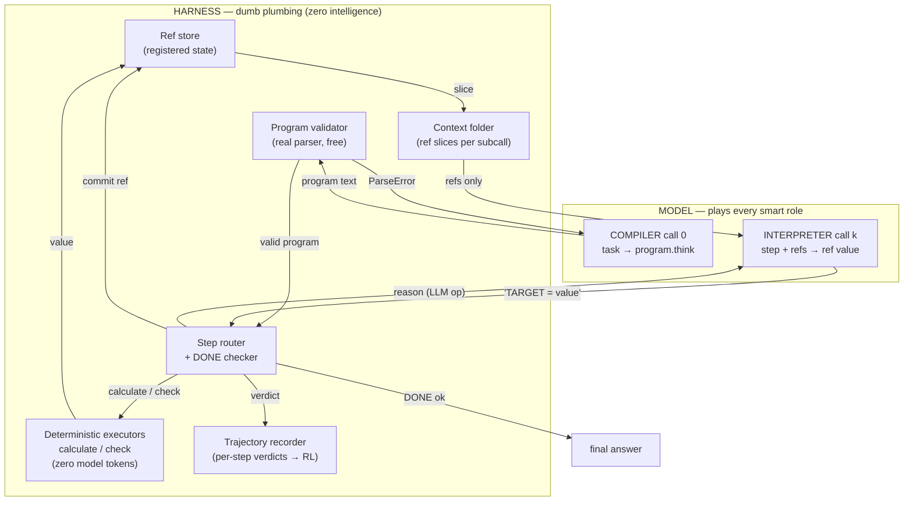
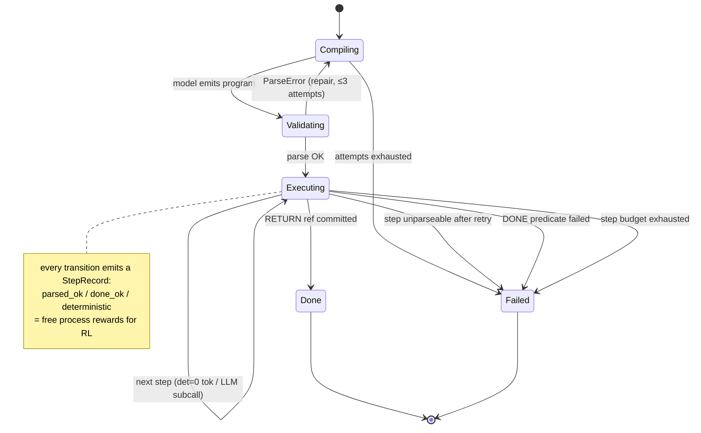
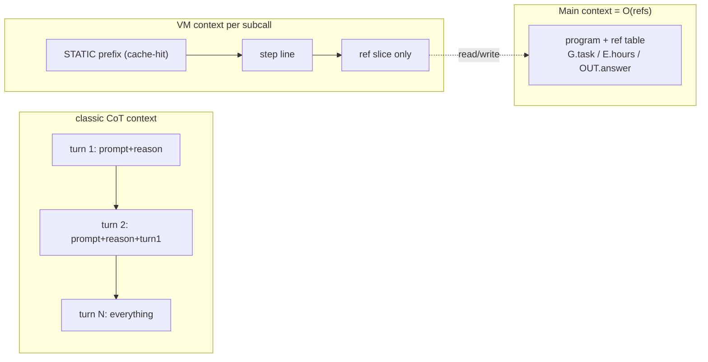
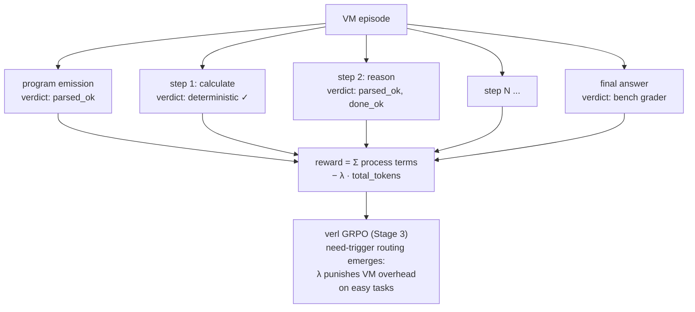

# TAHOE-VM: How It Works

> The model compiles a task into a TAHOE program, then executes that program
> on itself — one atomic self-subcall per reasoning step. The harness is dumb
> plumbing: refs, validation, local arithmetic, folding.
> Implemented: `src/tahoe/vm_mode/executor.py` · Pilot: `benchmarks/run_vm_bench.py`
> Dated 2026-09-14.

## 1. The big picture

TAHOE-VM is a tool-calling loop where the tool list has exactly one entry —
**the model itself**. The TAHOE program is the calling convention.



## 2. One episode, end to end

```mermaid
sequenceDiagram
    participant U as Task
    participant H as Harness
    participant M as Model (same weights)

    U->>H: task text
    H->>M: COMPILER call — canonical few-shot format
    M-->>H: program.think (2-8 typed steps)
    H->>H: parse_program() — free validation
    alt parse fails
        H->>M: REPAIR call — error + previous program
        M-->>H: corrected program (≤2 repairs)
    end

    loop each step (in order)
        alt op = calculate / check
            Note over H: local arithmetic — ZERO model tokens
            H->>H: commit ref (e.g. E.total = 273)
        else op = reason (LLM op)
            H->>M: INTERPRETER subcall — STATIC prefix<br/>+ step line + ref slice ONLY
            Note over M: fresh context; history folded away
            M-->>H: "OUT.answer = 273" (5-15 tokens)
            H->>H: parse + typecheck → retry once if invalid
        end
        H->>H: DONE predicate? (machine-computed reward)
    end

    H-->>U: RETURN ref value = final answer
```

## 3. Episode lifecycle (state machine)



## 4. Why context stays flat (folding)

Classic CoT re-sends everything each turn; the VM never does.



The ref slice is the **Markov state**: a step sees exactly the refs it names
as arguments (compiler must satisfy closure — `insights/vm-design.md`).

## 5. The trajectory = one RL episode (Stage 3 bridge)



Key economic fact (`insights/token-economics.md`): the compile call dominates
cost on easy tasks, so the optimal learned policy routes trivial tasks away
from the VM — Rule 15 (need-trigger) becomes a trained behavior instead of
prompt text.

## 6. Pilot results (2026-09-14, GLM-5.3-Flash, 30 samples/arm)

### The effort dial (measured trade-off)

`reasoning_effort` per phase turned out to be the dominant cost lever — and it
exposes a clean quality-vs-tokens dial:

| Config | gsm8k pass | gsm8k out | lsat pass | lsat out | lsat episodes OK |
|---|---|---|---|---|---|
| full effort (no param) | 60% | 2,649 | 50% | 2,160 | 18/30 |
| low everywhere (final) | 40% | **230** | 40% | **497** | **30/30** |
| prompt-tahoe (reference) | **83%** | **67** | **93%** | **267** | — |

Two engineering bugs found and fixed on the way: step retries lost their
phase tag (burned full-effort thinking), and compile never received the
effort param. After fixes: VM episodes execute 30/30 on LSAT, 59 deterministic
zero-token arithmetic steps on gsm8k, output tokens 1.9-3.4x prompt-tahoe
(was 21-41x).

### ⚠️ Honest caveat: strange results — bad implementation is a live hypothesis

These results are UNUSUAL enough that we flag them explicitly: a VM that loses
40 points of quality on LSAT while executing 30/30 episodes is suspicious.
Before treating the negative as fundamental, these implementation choices must
be re-examined — several are plausible primary causes:

1. **Truncated task context in step subcalls** — the interpreter slice included
   `task[:400]`; LSAT passages run 1,500+ characters. Reasoning steps likely
   saw a cut-off passage. This alone could explain the LSAT collapse.
2. **Forced over-decomposition** — the compiler prompt demanded 2-8 steps;
   tasks needing one holistic reasoning chain got shredded into 25-word ref
   fragments. Granularity was imposed, not learned.
3. **One canonical example for all task types** — a train-arrival few-shot for
   a compiler facing LSAT logic is a domain mismatch; benchmark-adaptive
   exemplars were never tried.
4. **Compile failures scored as zero** — 15-30% of episodes never executed;
   each counted as a wrong answer. A hybrid fallback (direct answer on VM
   failure) would rescue most of that mass and was not implemented.
5. **Double-solving left uncontrolled** — the compiler reasons about the task
   (955 hidden tokens) and then steps re-derive it; medium effort was never
   tested, only the degenerate ends.
6. **Max-token truncation** — 1,500 compile / 512 step budgets could cut
   reasoning mid-flight on long tasks.
7. **Ref-value answers vs grader formats** — OUT.answer carried raw ref values;
   format-sensitive graders (the BBH lesson) were never re-checked for the
   VM arm.

**Corrected claim**: "prompted-VM with THIS implementation loses to
prompt-tahoe on single-shot QA" — a measured, reproducible result. Whether
VM-with-a-good-implementation (adaptive granularity, full task context,
hybrid fallback, benchmark exemplars) loses remains OPEN. The RL framing
(Stage 3) inherits these as design knobs, not as fatal facts.

### Stage-2 verdict as originally recorded (gates FAILED)

1. **Prompted-VM loses to prompt-tahoe on both axes for single-shot QA.**
   Even at near-competitive token counts, quality is far below (40% vs
   83-93%). The gap is structural: 25-word refs + step isolation lose
   holistic reasoning; the compile call adds latency and failure modes.
2. **Structure as a SKILL inside one call (Stage 1) beats structure as an
   EXECUTION PROTOCOL across calls (Stage 2, this implementation) for
   single-shot tasks.**
3. **What the VM bought anyway**: machine-verifiable episodes (30/30),
   deterministic offload, O(refs) context, and the effort dial — which is a
   per-step ACTION in RL terms. Stage 3's question is now precise: can a
   learned policy (routing + granularity + effort per step) recover Stage-1
   quality while keeping Stage-2 verifiability? SR²AM's System III result
   (2026) says gating is learnable; nobody has done it over a typed program.


| Bench | Arm | Pass | In tok | Out tok | Episodes OK |
|---|---|---|---|---|---|
| gsm8k | classic | 63% | 69 | 202 | — |
| gsm8k | prompt-tahoe | **83%** | 158 | **70** | — |
| gsm8k | vm | 53% | 1,154 | 2,449 | 19/30 |
| lsat | classic | 93% | 408 | 519 | — |
| lsat | prompt-tahoe | **97%** | 497 | **197** | — |
| lsat | vm | 30% | 2,743 | 4,080 | 18/30 |

**Both token gates FAILED.** Verdict per plan:
1. Mechanism works: episodes execute, deterministic offload works
   (53 det steps on gsm8k), trajectories recorded, folding verified.
2. Prompted-VM is not competitive single-shot: compile-call overhead +
   over-decomposition quality loss (25-word refs too coarse for LSAT chains).
3. **Stage-2 outcome = go to Stage 3 (RL)**: outcome − λ·tokens reward makes
   routing learned; RL also learns program granularity (when 25-word refs
   suffice vs when the program should reason holistically in one step).

The failure classes are themselves signal for RL: parse failures → repair
reward; empty decomposition value → negative process reward; over-decomposition
→ token penalty.
